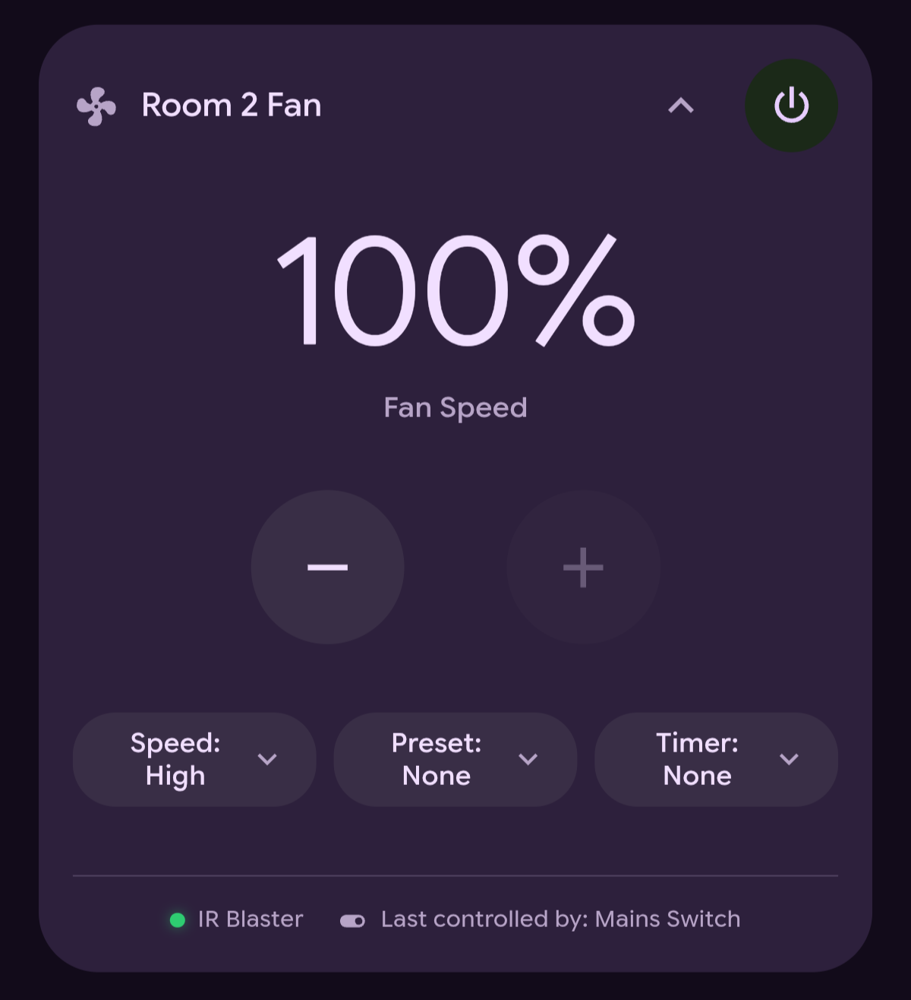
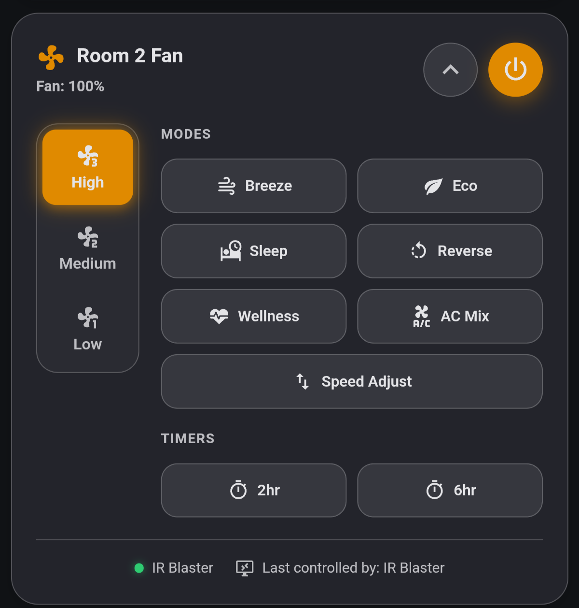
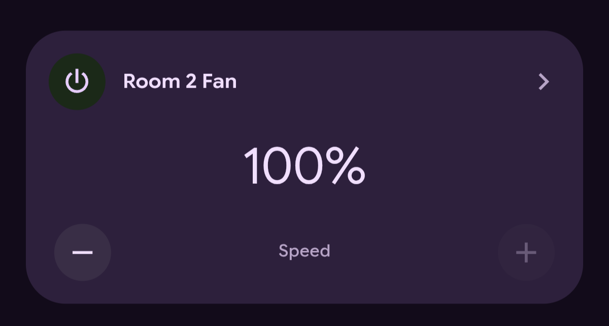
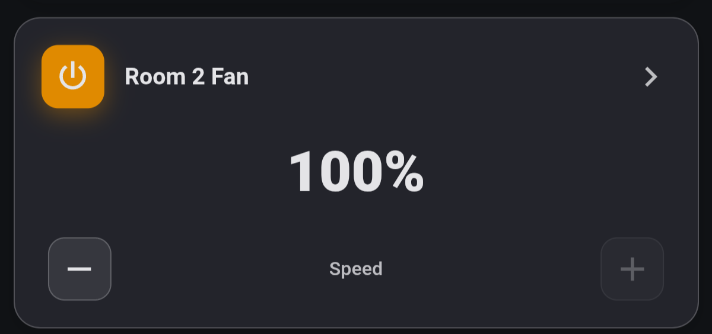

# Indian BLDC Fan Card (formerly Superfan Card) (`superfan-card`)

[](https://github.com/hacs/integration)
[](https://github.com/selvakk2k/superfan-card/releases/latest)
[](https://github.com/selvakk2k/superfan-card/releases)
[](https://github.com/selvakk2k)
[](https://aiattribution.github.io/interpret-attribution)

A custom Lovelace dashboard card for Indian BLDC ceiling fans (Atomberg, Superfan, Orient, Activa, Goldmedal), designed for use with the [Indian BLDC Fan Integration](https://github.com/selvakk2k/superfan_ir) or any standard Home Assistant `fan` entity.

---

## Features

* **Multi-Brand Speed Tiers**: Automatically renders 6-speed (Atomberg, Activa, Goldmedal), 5-speed (Superfan T10, Orient), or 3-speed (Superfan T12/6) speed rails based on the fan entity's speed step attributes.
* **Dynamic Preset & Timer Pills**: Auto-wraps and balances preset buttons (Breeze, Eco, Sleep, Reverse, Boost, Timers) with clean typography and no awkward empty layout voids.
* **Multiple Visual Layouts**: Seamless Google Home design and structured Classic card views with subtle ambient active glow indicators.
* **Contextual Help & Guard Warnings**: Long-press any preset button on mobile touchscreens or hover on desktop to view functional descriptions, or tap while the device is offline/off for non-blocking toast notifications.
* **Visual Editor Support**: Easily configure entity bindings, card titles, and custom theme accent colors directly within the Lovelace GUI editor.
* **Dynamic Theming & Theme Compatibility**: Fully responsive across default Home Assistant themes and dark mode, optimized for the [Material You Theme by Nerwyn](https://github.com/Nerwyn/material-you-theme) (Google Home layout) and the [Graphite Theme by Tilman Griesel](https://github.com/TilmanGriesel/graphite) (Classic layout).

---

## Screenshots

| Google Home Style<br>*(shown with [Material You Theme](https://github.com/Nerwyn/material-you-theme))* | Classic Card Style<br>*(shown with [Graphite Theme](https://github.com/TilmanGriesel/graphite))* |
| :---: | :---: |
| **Full View**<br> | **Full View**<br> |
| **Compact View**<br> | **Compact View**<br> |

---

## Installation

### Method 1: Via HACS (Recommended)

[](https://my.home-assistant.io/redirect/hacs_repository/?owner=selvakk2k&repository=superfan-card&category=plugin)

1. Click the **Open repository in HACS** button above, or open **HACS** from your Home Assistant sidebar.
2. Click the top-right menu (⋮) → **Custom repositories** → Add `https://github.com/selvakk2k/superfan-card` with category **Dashboard**.
3. Search for **Indian BLDC Fan Card**, click **Download**, and reload your dashboard.

### Method 2: Manual Installation
1. Download `superfan-card.js` from the [Releases](https://github.com/selvakk2k/superfan-card/releases) page.
2. Place the file into `<config>/www/superfan-card.js`.
3. In Home Assistant, go to **Settings → Dashboards → Resources** → Add `/local/superfan-card.js` as a **JavaScript Module**.

---

## Usage & Configuration

Add via the card picker (search for **Indian BLDC Fan Card**) or paste manually into YAML:

```yaml
type: custom:superfan-card
entity: fan.living_room_fan
name: Living Room Fan
theme: default
layout: default
full_layout: google_home
```

### Configuration Options

| Field | Type | Default | Description |
| :--- | :--- | :--- | :--- |
| `entity` | string | **Required** | The `fan.*` entity ID to control. |
| `name` | string | Optional | Custom friendly title to display in the card header. |
| `theme` | string | `default` | Visual theme: `default` (Standard HA Theme) or `material_you` (Material You). |
| `layout` | string | `default` | Card geometry: `default` (Full View) or `compact` (Expandable compact row). |
| `full_layout` | string | `default` | Full view layout style: `default` (Classic) or `google_home` (Google Home). |
| `accent_color` | string | Optional | Override the active highlight color (hex code or theme token). |
| `main_color` | string | Optional | Override the background card surface color. |

---

## My Integrations & Lovelace Cards

| Integration / Card | Category | Description | Status |
| :--- | :--- | :--- | :--- |
| [Panasonic AC India](https://github.com/selvakk2k/ha-miraie-ac-in) | Integration | Local IR & Cloud MQTT control for Panasonic MirAIe Air Conditioners | `Beta` |
| [Panasonic AC India Card](https://github.com/selvakk2k/miraie-ac-card-in) | Lovelace Card | Modern Lovelace card for Panasonic ACs | `Beta` |
| [Indian BLDC Fan IR](https://github.com/selvakk2k/superfan_ir) | Integration | Native Home Assistant integration for Indian BLDC ceiling fans (Superfan, Atomberg) | `Beta` |
| [Indian BLDC Fan Card](https://github.com/selvakk2k/superfan-card) | Lovelace Card | Interactive Lovelace card with speed dial & mode toggles for BLDC fans | `Beta` |
| [IFB Washer Local](https://github.com/selvakk2k/ifb-washer-local) | Integration | Local Wi-Fi integration for IFB Front Load Washing Machines & Washer Dryers | `Beta` |
| [IFB Washer Card](https://github.com/selvakk2k/ifb-washer-card) | Lovelace Card | Dedicated Lovelace card for IFB washers & dryers with cycle controls | `Beta` |
| [Tinxy Local Python](https://github.com/selvakk2k/ha-tinxylocal) | Integration | Pure-Python local control for Tinxy smart switches and modules | `Stable` |

---

## Credits & License

### Project Contributors & AI Attribution
* **Lead Architecture & Hardware Validation**: [@selvakk2k](https://github.com/selvakk2k) — physical testing on Indian BLDC fan remotes, Lovelace UX requirements, and design tokens.
* **Code Implementation & Engineering**: **Antigravity** (Google DeepMind) — custom card component architecture, dynamic speed scaling, responsive flex-wrap layout, and HACS compliance.
* **Pre-Release Code Review & Auditing**: **Claude** (Anthropic) — independent code review, CSS architecture audits, and edge-case verification.

Licensed under the **MIT License**. See the [LICENSE](LICENSE) file for details.
