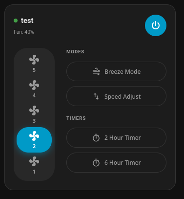
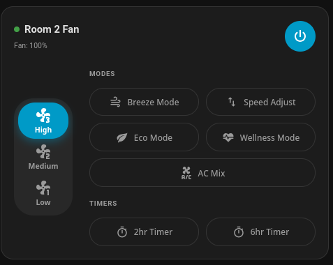
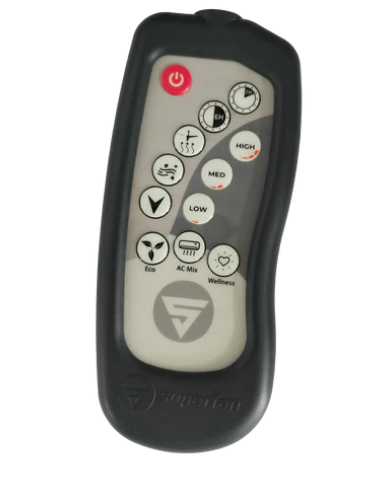

# Superfan Custom Lovelace Card (`superfan-card`)

[](https://github.com/hacs/integration)
[](https://github.com/selvakk2k/superfan-card/releases/latest)
[](https://github.com/selvakk2k/superfan-card/releases)
[](https://github.com/selvakk2k)
[](https://aiattribution.github.io/interpret-attribution)

A custom Lovelace card for the [Superfan IR integration](https://github.com/selvakk2k/superfan_ir).

## Features

- **Auto-detects fan speed count** — shows a 5-button selector for the T10 and a 3-button (High / Medium / Low) selector for the T12/T6
- **Preset buttons** — dynamically lists all preset modes exposed by the integration (Breeze Mode, Speed Adjust, Timer modes, etc.)
- **Side-by-side layout** — vertical speed selector on the left, presets on the right
- **Visual config editor** — entity picker, custom name, and accent colour — no YAML required
- **Accent colour** — override your HA theme's primary colour per card
- **Follows HA theme** — works in both light and dark mode

## Screenshots

| T10 (5-speed) | T12 (3-speed) |
|---|---|
|  |  |
|  |  |

## Installation

### HACS (recommended)

1. Open HACS → Frontend → ⋮ → Custom repositories
2. Add `https://github.com/selvakk2k/superfan-card` with category **Dashboard**
3. Install **Superfan Card**

### Manual

1. Download `superfan-card.js` from the [latest release](https://github.com/selvakk2k/superfan-card/releases/latest)
2. Copy it to `config/www/superfan-card.js`
3. In Home Assistant: **Settings → Dashboards → Resources** → Add `/local/superfan-card.js` as a **JavaScript Module**

## Usage

Add via the visual editor (search for **Superfan Card**), or paste manually.

> [!TIP]
> Under the **Layout** tab in the card editor, it is recommended to set:
> - **Width (Columns)**: **9** for the T10 remote.
> - **Width (Columns)**: **12** for the T12/6 remote.
>
> This ensures that the buttons and panels scale to their optimal, intended proportions.

Add via the card picker or paste manually:

```yaml
type: custom:superfan-card
entity: fan.superfan
name: Superfan T10        # optional
accent_color: "#03a9f4"   # optional, overrides theme accent
```

## Configuration options

| Option | Type | Default | Description |
|---|---|---|---|
| `entity` | string | **required** | The `fan.*` entity from the Superfan IR integration |
| `name` | string | Friendly name | Override the card title |
| `accent_color` | string | Theme primary | Hex colour for active state highlight |

## Requirements

- Home Assistant 2024.x or later
- [Superfan IR integration](https://github.com/selvakk2k/superfan_ir) installed and configured

## Credits & License

### Project Contributors & AI Attribution
* **Lead Architecture & Hardware Validation**: [@selvakk2k](https://github.com/selvakk2k) — physical testing on Superfan remotes, Lovelace UX requirements, and theme design.
* **Code Implementation & Engineering**: **Antigravity** (Google DeepMind) — custom Lovelace card implementation, dynamic remote scaling, responsive speed selectors, and HACS packaging.
* **Pre-Release Code Review & Auditing**: **Claude** (Anthropic) — independent code review, CSS architecture audits, and edge-case verification.

Licensed under the **MIT License**. See the `LICENSE` file for the full license text.
